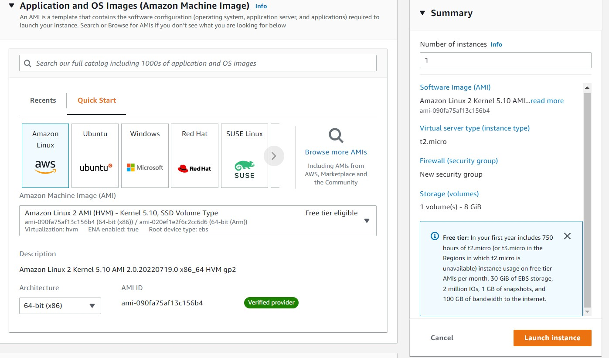
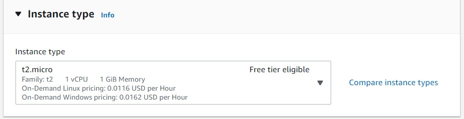
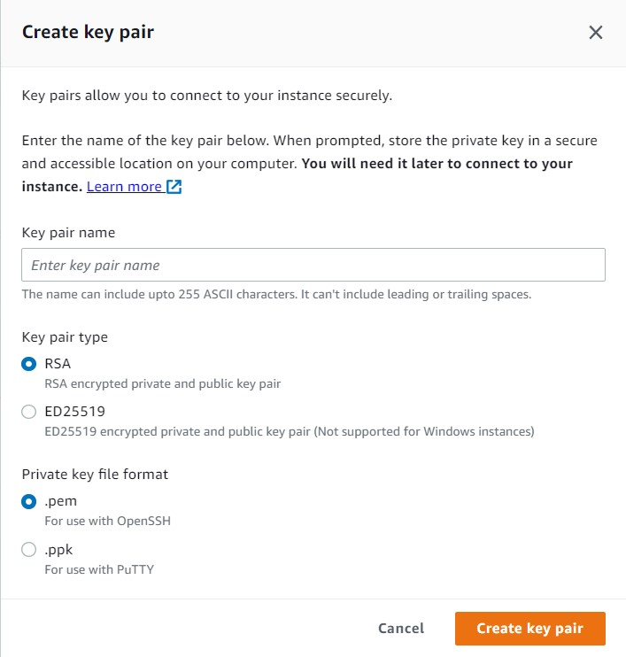
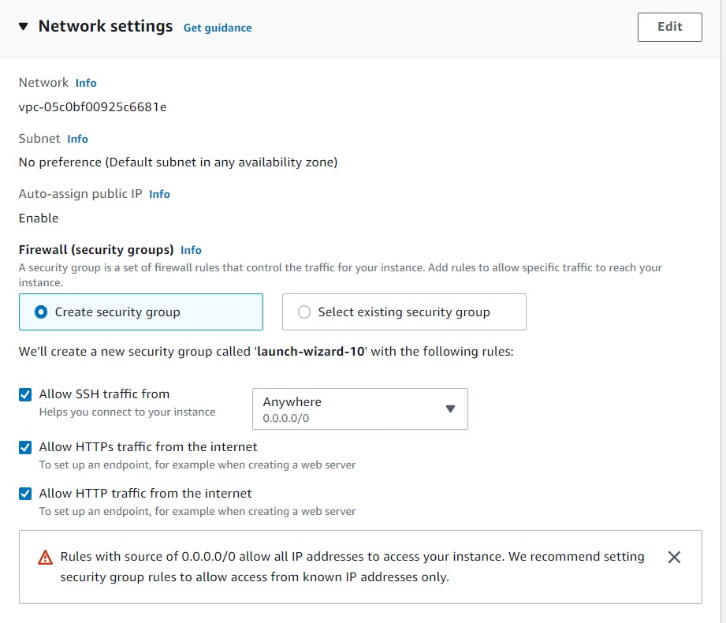
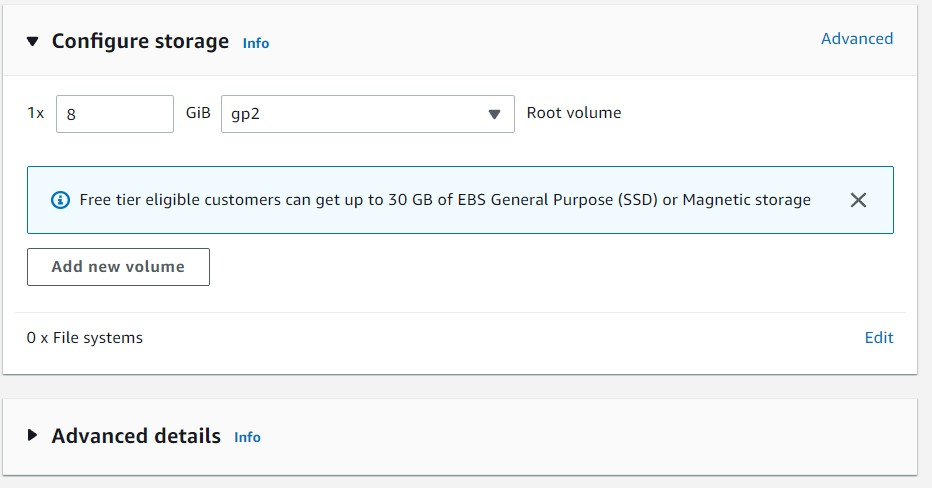
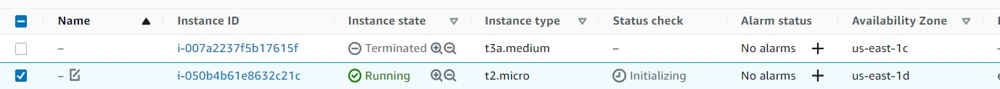
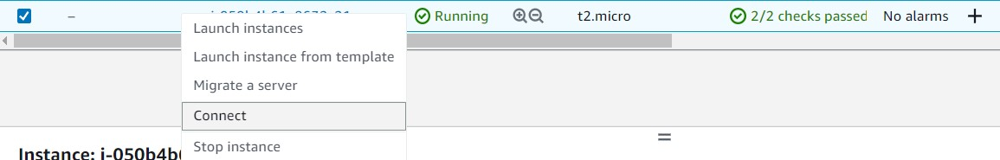
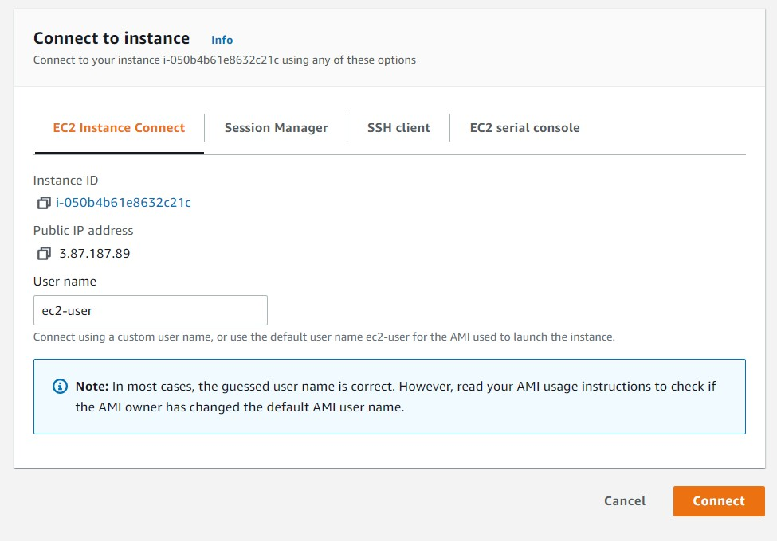
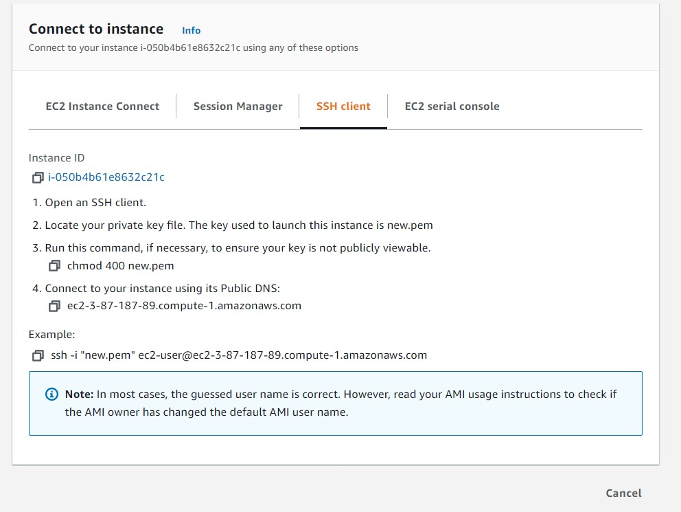

# creating the instance

## 1.choose the os
>in this tutorial is amazon linux ami 2

## 2.now the hardware

>be careful if you want to stay in the free tier

## 3.now for the security keys
> choose create new pair option

> then choose between .pem and .ppk

*.pem is used from the terminal*

*.ppk is used if you have PuTTy or WinSCP installed on your pc*

## 4.network

## 5. storage and ram

>be careful if you want to stay in the free tier

## 5.1 advanced details

>we will not go thruogh this but you can allocate a gpu. And do some other stuff

## 6. fininsh and intialize the instance

## 7. in the console the instance is still intializing

## 8. when the instance is ready and running

> right click and connect

## 9.1 you can connect through amazon terminal

> click connect

## 9.2 you can connect through Putty or whatever

> step no. 4 contains the DNS to connect to

> the DNS ofcourse you call it in postman ...etc

# Congrats you instantiated an instance successfully 🎉🎈