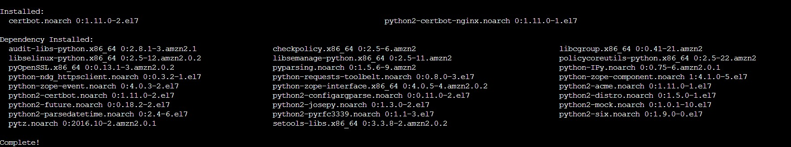

**see the linux version**

```
cat /etc/os-release
```

## install epel
```
sudo amazon-linux-extras install epel -y
```

>python3 had a problem till this time july-2022

> so we will do it in python2

# install cer tbot for nginx
```
sudo yum install -y certbot python2-certbot-nginx
```
you should see output like this 



**it will require you to enter emainl address and agree to some terms and add your website domain name**

**if you don't have a domaan name leave it _**
